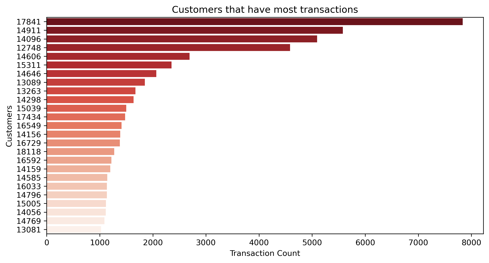
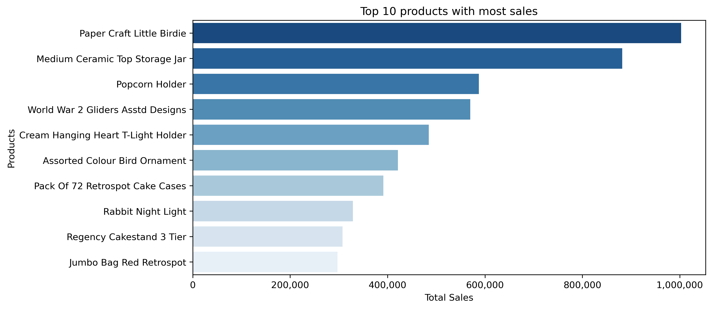
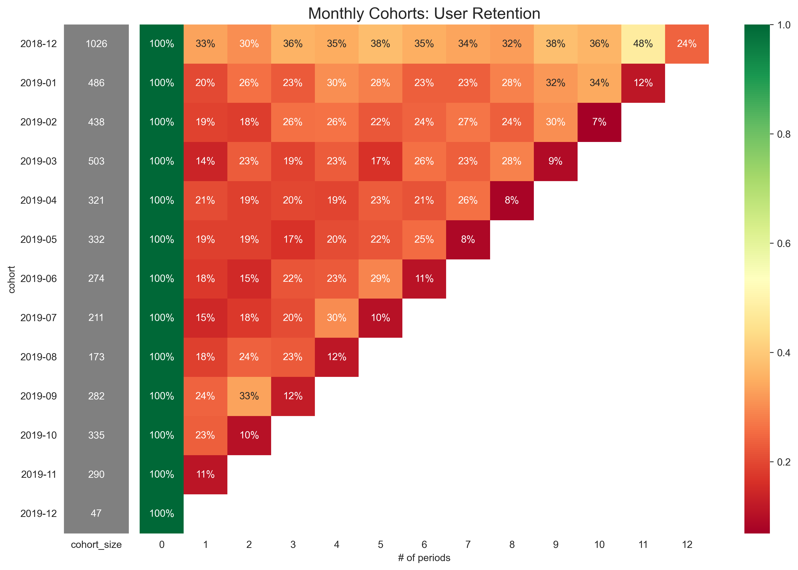

# E-commerce Business Transaction Analysis
**Market Basket & Cohort Analysis**

This repository contains a Jupyter Notebook for analyzing e-commerce transactions to uncover actionable insights via **Market Basket Analysis** (association rules) and **Cohort Analysis** (customer retention over time).

> Notebook: `E-commerce Business Transaction Market (Market Basket and Cohort Analysis).ipynb`

---

## Example Visuals

<p align="center">
  
  
</p>

<p align="center">
  
</p>

> The exact visuals depend on your dataset and filters. The above images are exported directly from the notebook outputs.

---

## Dataset
- **Source:** [E-commerce Business Transaction Dataset on Kaggle](https://www.kaggle.com/datasets/gabrielramos87/an-online-shop-business)
- **Content:** Contains UK-based online retail transactions for one year. This London-based shop has been selling gifts and homewares for adults and children through the website since 2007. Their customers come from all over the world and usually make direct purchases for themselves. There are also small businesses that buy in bulk and sell to other customers through retail outlet channels.
- **Schema:** `TransactionNo`, `Date`, `ProductNo`, `Product`, `Price`, `Quantity`, `CustomerNo`, `Country`
- **Description of Schema:**
- **TransactionNo** (categorical): a six-digit unique number that defines each transaction. The letter “C” in the code indicates a cancellation.
- **Date** (numeric): the date when each transaction was generated.
- **ProductNo** (categorical): a five- or six-digit unique character used to identify a specific product.
- **Product** (categorical): product/item name.
- **Price** (numeric): the price of each product per unit in pound sterling (£).
- **Quantity** (numeric): the quantity of each product per transaction. Negative values relate to cancelled transactions.
- **CustomerNo** (categorical): a five-digit unique number that defines each customer.
- **Country** (categorical): name of the country where the customer resides.

- **Notes:**
  - `Quantity < 0` indicates returns/cancellations (often prefixed with `C` in `TransactionNo`).
  - `TotalPrice = Quantity * Price`
  - Parse dates to monthly buckets for cohort analysis.

---

## ️ Requirements
- Python >= 3.8
- Recommended packages:
  ```bash
  pip install pandas numpy matplotlib seaborn mlxtend squarify
  ```
  *(If you maintain `requirements.txt` or `environment.yml`, include them in this repo and prefer them over the above.)*

---

## Analysis Outline

### 1) Exploratory Data Analysis (EDA)
- Inspect structure and quality: `df.info()`, `df.describe()`
- Clean-up: handle missing values, cancelations/returns, outliers
- Feature engineering: `TotalPrice`, monthly aggregates
- Visuals: distributions, top products, sales trends

### 2) Market Basket Analysis (Association Rules)
- Build a transaction-product **basket** (one-hot encoding per transaction)
- Find frequent itemsets via **Apriori**
- Derive rules with **support**, **confidence**, **lift**
- Filter and sort to surface high-value cross-sell pairs/sets

```python
from mlxtend.frequent_patterns import apriori, association_rules

frequent_itemsets = apriori(basket_df, min_support=0.01, use_colnames=True)
rules = association_rules(frequent_itemsets, metric="lift", min_threshold=1.0)
rules = rules.sort_values(["lift", "confidence"], ascending=False)
```

### 3) Cohort Analysis
- **CohortMonth** = month of a customer's first purchase
- **CohortIndex** = months since first purchase
- Build **retention matrix** and visualize as heatmap
- Track repeat purchase behavior, revenue per cohort

```python
df["InvoiceMonth"] = df["Date"].values.astype("datetime64[M]")
df["CohortMonth"]  = df.groupby("CustomerNo")["InvoiceMonth"].transform("min")
df["CohortIndex"]  = ((df["InvoiceMonth"].dt.year - df["CohortMonth"].dt.year) * 12 +
                      (df["InvoiceMonth"].dt.month - df["CohortMonth"].dt.month))

cohort_users = (df.groupby(["CohortMonth","CohortIndex"])["CustomerNo"]
                  .nunique().reset_index()
                  .pivot(index="CohortMonth", columns="CohortIndex", values="CustomerNo"))

retention = cohort_users.divide(cohort_users[0], axis=0).round(3)
```

---

## 🔎 Interpreting Results
- **High-lift rules** suggest strong cross-sell opportunities (e.g., bundles, recommendations)
- **Retention hot spots** (bright cells early on) signal sticky cohorts; investigate channels or campaigns that drove them
- **Drop-off patterns** can inform lifecycle marketing and post-purchase nurturing

---

> Maintainer: <Panagiota Katsourani Seledonio> · Contact: <pkatsourani>
